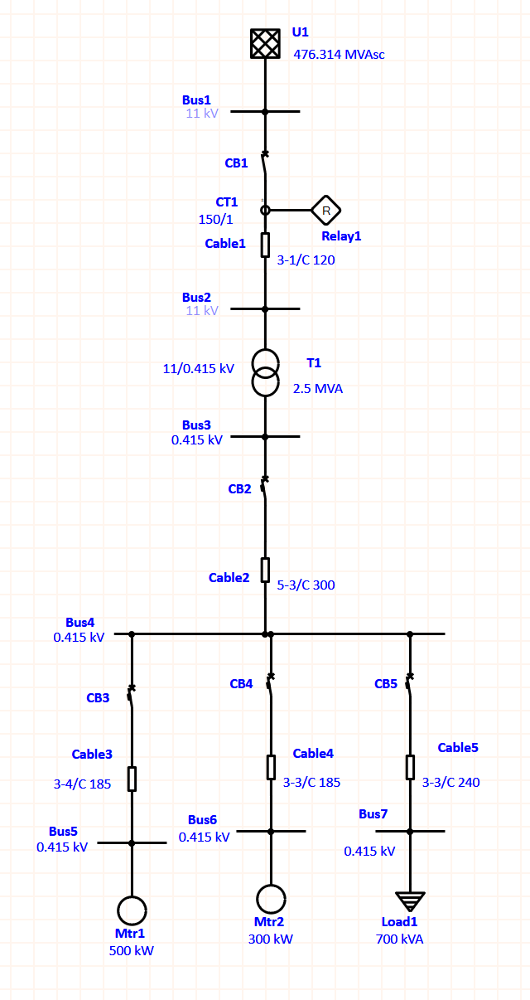

# ETAP Ground Fault and Phase Protection Coordination

Portfolio study of phase and ground-fault protection coordination for an industrial 11 kV/0.415 kV distribution system supplying a 2.5 MVA transformer and a 500 kW motor load.

## Study objective

The project extends an existing load-flow, short-circuit, device-duty, motor-starting, and arc-flash model. It verifies selective operation of the downstream motor feeder breaker, the LV incomer breaker, and the upstream transformer-feeder relay for phase and line-to-ground faults.



## Final protection sequence

| Fault location | Primary protection | Total clearing time | Backup protection | Total clearing time |
|---|---:|---:|---:|---:|
| Bus5 | CB3 ground | 120 ms | CB2 ground | 360 ms |
| Bus4 | CB2 ground | 360 ms | CB2 phase | 480 ms |
| Bus4 | CB2 phase | 480 ms | Relay1 phase 51 / CB1 | 3.614 s / 3.634 s |

The Bus5 ground grading interval is 240 ms. CB2 begins its ground trip sequence at 240 ms, providing a 120 ms reset margin after CB3 completes clearing at 120 ms. For the Bus4 fault, Relay1 remains slower than both CB2 ground and phase functions. The 3.614 s relay operating time was retained because faster settings compromised the complete phase-coordination study.

## Key results

- Bus5 line-to-ground fault: CB3-G operates first, followed by CB2-G backup.
- Bus4 line-to-ground fault: CB2-G operates before CB2 phase protection.
- Relay1 phase 51 provides upstream backup through CB1.
- AutoStar reports the assessed CB2-CB3, CB2-CB4, and CB2-CB5 phase and line-to-ground pairs as coordinated over the evaluated current ranges.
- Transformer inrush, motor starting, and equipment-damage boundaries were retained in the phase-coordination review.

## Repository structure

```text
docs/
  ETAP_Protection_Coordination_Engineering_Report.docx
  ETAP_Protection_Coordination_Engineering_Report.pdf
images/
  system_single_line_diagram.png
  phase_coordination_tcc.png
  ground_coordination_tcc.png
  bus4_ground_fault_sequence.png
  bus5_ground_fault_sequence.png
data/
  protection_sequence_results.csv
```

## Engineering limitations

The protection settings are a training and portfolio study. Final field settings require the selected manufacturers' tolerances, CT accuracy and saturation checks, actual grounding data, minimum and maximum utility fault levels, cable thermal limits, transformer through-fault withstand, and approval by the responsible protection engineer.

The native ETAP database is not included because it contains version-specific database files. The screenshots and report provide reproducible evidence of the study outputs.

## Software

- ETAP 19.0.1
- Star Protective Device Coordination
- Sequence of Operation
- AutoStar evaluation

## Author

Rabih Kamal Al Ahmadieh
